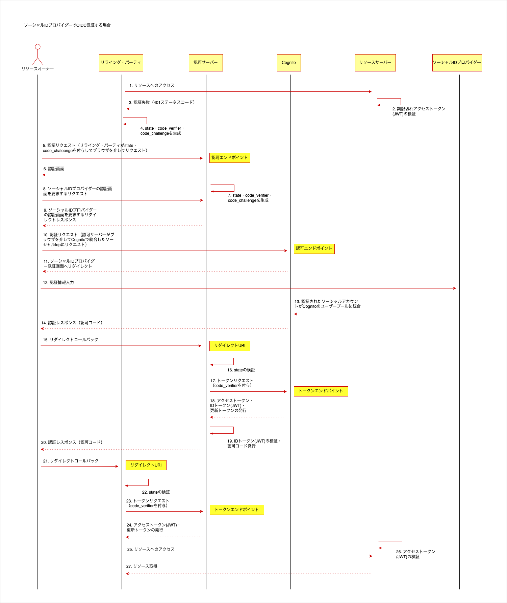

# Laravel Cognito OAuth

## create environment
```bash
$ make init
```

Look http://localhost:80

### start container
```bash
$ make start
```

### stop contaner
```bash
$ make stop
```

### install package
```bash
$ make install
```

## sequence
### Social ID Provide

